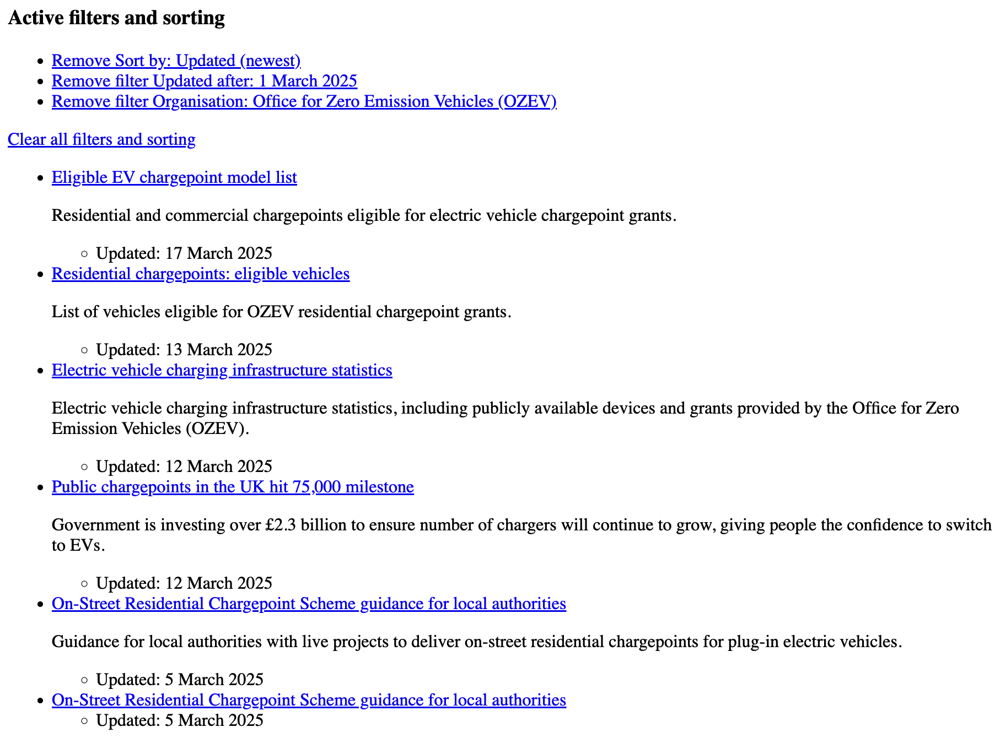

# UKGovScraper

This repository contains a web scraping tool designed to extract search results from UK government websites. The tool consists of two main classes:

- `URLCreator` - Generates search URLs for UKGov.com based on user-defined criteria.
- `UKGovScraper` - Scrapes the search results and extracts relevant links.

## Installation

Ensure you have Python installed along with the necessary dependencies. You can install the required dependencies using:

```sh
pip install -r requirements.txt
```

## Usage

```python
from URLCreator import URLCreator
from UKGovScraper import UKGovScraper

settings = {
    'search_terms': ['electric vehicle', 'funding amount', 'chargepoint'],
    'order': 'updated-newest',
    'start': '2025-03-01',
    # 'end': '2024-12-31',
    'organisations': ['office-for-zero-emission-vehicles']
}

s = UKGovScraper()
search_results = s.scrape(settings)
```

### Parameters for `settings`

- `search_terms` (list): Keywords to search for.
- `order` (str): Sorting order of results (e.g., `updated-newest`).
- `start` (str): Start date for filtering results (`YYYY-MM-DD`).
- `end` (str, optional): End date for filtering results (`YYYY-MM-DD`).
- `organisations` (list, optional): List of organisations to filter results by.

### Example Search Parameters

For the above settings, this is the search result:


## Contributing

1. Fork the repository.
2. Create a new branch (`feature-branch`).
3. Commit your changes.
4. Push to the branch.
5. Open a Pull Request.

## License

This project is licensed under the MIT License.

